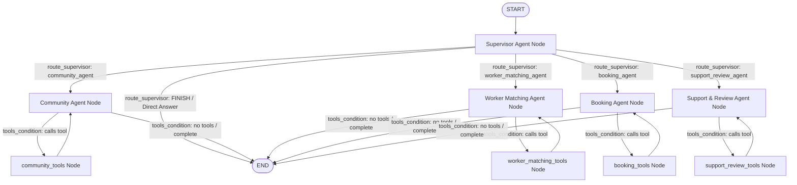
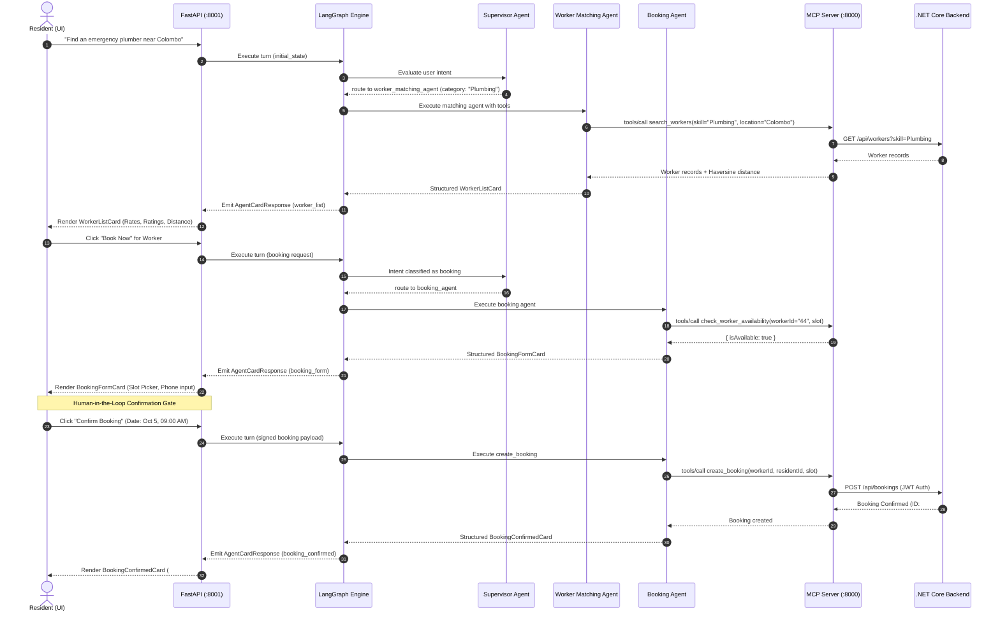
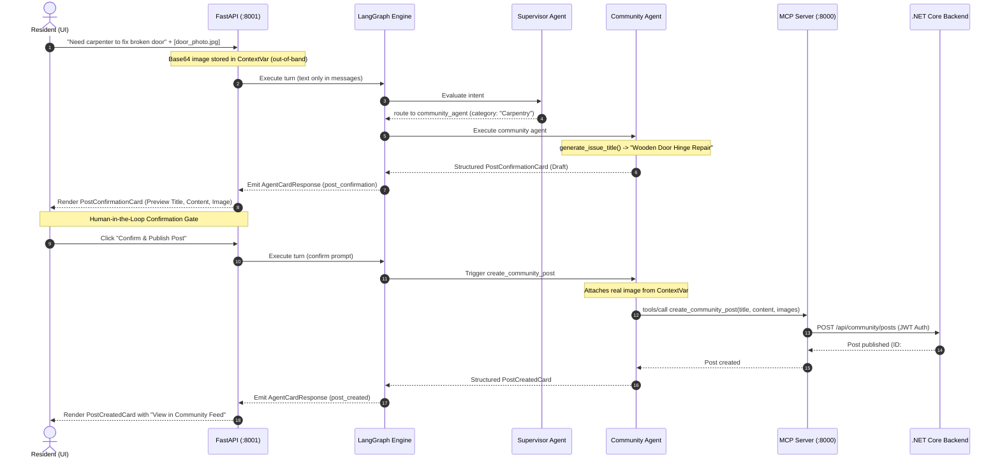
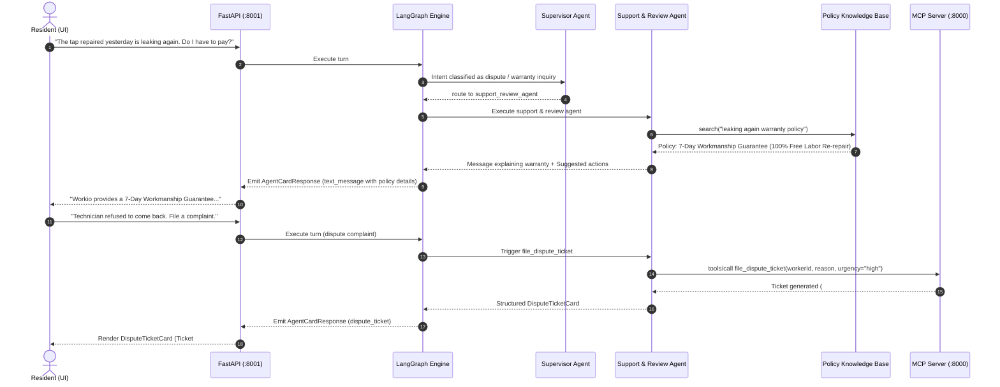

# 4. Agentic AI System

---

## 4.1 Agentic AI Overview

The **Workio Agentic AI System** is an intelligent, multi-agent conversational platform engineered to streamline home service discovery, technician matchmaking, appointment scheduling, community engagement, and post-service dispute resolution. Rather than relying on static chatbots or monolithic Large Language Model (LLM) prompts, Workio implements an **agentic architecture** powered by **LangGraph**, **OpenAI (`gpt-4o-mini`)**, and the **Model Context Protocol (MCP)**.

```
                              ┌───────────────────────────────────┐
                              │           USER / BROWSER          │
                              └─────────────────┬─────────────────┘
                                                │
                                                ▼
                              ┌───────────────────────────────────┐
                              │      React / Vite Frontend        │
                              │     (AiCommunityChat.jsx)         │
                              └─────────────────┬─────────────────┘
                                                │  POST /api/chat
                                                ▼
                              ┌───────────────────────────────────┐
                              │     FastAPI Agent Backend :8001   │
                              │     - Neon PostgreSQL Session     │
                              │     - TurnUsageLogger Telemetry   │
                              └─────────────────┬─────────────────┘
                                                │
                                                ▼
                              ┌───────────────────────────────────┐
                              │       LangGraph StateGraph        │
                              │        (AgentState Reducer)       │
                              └─────────────────┬─────────────────┘
                                                │
                                                ▼
                              ┌───────────────────────────────────┐
                              │      SUPERVISOR AGENT (LLM #1)    │
                              │   Intent Classification & Router  │
                              └───────┬─────────┬─────────┬───────┘
                                      │         │         │
                 ┌────────────────────┼─────────┴─────────┼───────────────────┐
                 ▼                    ▼                   ▼                   ▼
        ┌─────────────────┐  ┌─────────────────┐  ┌────────────────┐  ┌─────────────────┐
        │ Community Agent │  │ Worker Matching │  │  Booking Agent │  │ Support & Review│
        │   (LLM Node)    │  │ Agent (LLM Node)│  │   (LLM Node)   │  │ Agent (LLM Node)│
        └────────┬────────┘  └────────┬────────┘  └───────┬────────┘  └────────┬────────┘
                 │                    │                   │                    │
                 ▼                    ▼                   ▼                    ▼
        ┌─────────────────┐  ┌─────────────────┐  ┌────────────────┐  ┌─────────────────┐
        │ Community Tools │  │  Worker Tools   │  │ Booking Tools  │  │  Support Tools  │
        │   (ToolNode)    │  │   (ToolNode)    │  │   (ToolNode)   │  │   (ToolNode)    │
        └────────┬────────┘  └────────┬────────┘  └───────┬────────┘  └────────┬────────┘
                 └────────────────────┼───────────────────┼────────────────────┘
                                      │
                                      ▼ JSON-RPC 2.0 over HTTP
                              ┌───────────────────────────────────┐
                              │       Workio MCP Server :8000     │
                              │    (18 Standardized MCP Tools)    │
                              └─────────────────┬─────────────────┘
                                                │  JWT Bearer Auth
                                                ▼
                              ┌───────────────────────────────────┐
                              │    SuperBass .NET Core Backend    │
                              │               :5237               │
                              └─────────────────┬─────────────────┘
                                                │
                                                ▼
                              ┌───────────────────────────────────┐
                              │     PostgreSQL Database Core      │
                              └───────────────────────────────────┘
```

### Architectural Principles and "Architecture A" Pattern

The system is constructed around the **"Architecture A" Pattern**, characterized by:
1. **Two Logical LLM Stages:**
   - **Stage 1 (Supervisor):** Deconstructs unstructured user input, resolves domain intent, extracts service categories from 21 standardized Workio categories, and routes the context to the appropriate specialist agent (or returns a direct conversational response).
   - **Stage 2 (Specialist Agent):** Executes domain reasoning, invokes domain-specific MCP tools in autonomous loops, interprets raw database outputs, and constructs typed UI card payloads.
2. **Direct Tool-to-UI Mapping:**
   Specialist agents directly assemble validated, Pydantic-typed UI cards (`AgentCardResponse`). **No redundant LLM-based formatting node** exists between tool execution and UI emission, minimizing latency, token cost, and formatting hallucinations.
3. **Decoupled Tool Protocol via MCP:**
   Business capabilities (database queries, booking scheduling, community posts, review submissions) are fully decoupled from the LLM framework and exposed via standardized JSON-RPC 2.0 endpoints adhering to the **Model Context Protocol (MCP)** specification.
4. **Zero-Trust Human-in-the-Loop (HITL) Gateways:**
   Destructive or committing operations (publishing community posts, reserving technician slots, processing complaints) require explicit visual confirmation from the user through interactive frontend cards before state-modifying tools execute.

---

## 4.2 Agent Architecture and Agent Roles

The multi-agent system divides domain responsibilities into five discrete agents: one central **Supervisor Agent** and four **Domain Specialist Agents**.

```
                           ┌────────────────────────┐
                           │    SUPERVISOR AGENT    │
                           │  - Intent Evaluator    │
                           │  - Category Normalizer │
                           │  - Suggested Actions   │
                           └───────────┬────────────┘
                                       │
        ┌──────────────────┬───────────┴───────────┬──────────────────┐
        ▼                  ▼                       ▼                  ▼
┌────────────────┐ ┌────────────────┐      ┌────────────────┐ ┌────────────────┐
│Community Agent │ │Worker Matching │      │ Booking Agent  │ │Support & Review│
│- Post CRUD     │ │- Haversine GPS │      │- Slot Checking │ │- Post-Job Stars│
│- Category Feed │ │- Vetting & Rate│      │- Date Parsing  │ │- Dispute Ticket│
│- Media Handler │ │- Skill Matches │      │- Appointments  │ │- RAG Policies  │
└────────────────┘ └────────────────┘      └────────────────┘ └────────────────┘
```

### 1. Supervisor Agent (`supervisor_node`)
* **File:** [`agent_backend/agents/supervisor.py`](file:///d:/Projects_New/SuperBass/agent-backend/src/agent_backend/agents/supervisor.py)
* **LLM Engine:** `ChatOpenAI(model="gpt-4o-mini")` with `.with_structured_output(SupervisorDecision, method="function_calling")`.
* **Primary Role:**
  - Evaluates user intent without fragile regex keywords.
  - Dynamically fetches the 21 live Workio service categories (`get_live_service_categories()`) and classifies ambiguous problems (e.g., mapping *"water leaking from kitchen sink"* directly to the `"Plumbing"` category).
  - Routes the conversation to one of:
    - `"community_agent"`
    - `"worker_matching_agent"`
    - `"booking_agent"`
    - `"support_review_agent"`
    - `"FINISH"` (for greetings, platform questions, or clarification turns).
  - Supplies dynamic suggestion chips (`suggested_actions`) tailored to the context while strictly filtering out DIY tips or advice to prioritize professional platform engagement.

### 2. Community Specialist Agent (`community_agent_node`)
* **File:** [`agent_backend/agents/community_agent.py`](file:///d:/Projects_New/SuperBass/agent-backend/src/agent_backend/agents/community_agent.py)
* **Domain Responsibilities:**
  - Manages the entire lifecycle of community classified posts and emergency service requests.
  - Generates concise, issue-specific post titles via `generate_issue_title()` (avoiding generic placeholders like *"Community Post"* or *"Need Help"*).
  - Integrates with user identity context (`email`, `user_type`, `displayName`) to ensure correct author attribution.
  - Employs scoped Python `ContextVar` (`current_post_images`) to handle base64 image uploads out-of-band, preventing token limits and 400 ContextLengthExceeded errors.
* **Emitted UI Cards:** `PostConfirmationCard`, `PostCreatedCard`, `PostListCard`, `PostDetailCard`, `PostUpdatedCard`, `PostDeletedCard`, `UserProfileCard`.

### 3. Worker Matching Specialist Agent (`worker_matching_agent_node`)
* **File:** [`agent_backend/agents/worker_matching_agent.py`](file:///d:/Projects_New/SuperBass/agent-backend/src/agent_backend/agents/worker_matching_agent.py)
* **Domain Responsibilities:**
  - Searches and discovers verified local technicians based on trade skill, ratings, budget constraints, and availability.
  - Performs **geospatial proximity ranking** using the Haversine distance formula against resident GPS coordinates (`user_lat`, `user_lng`) or Sri Lankan district centers (`SRI_LANKA_CITY_COORDS`).
  - Normalizes colloquial problem terms against the 21 official categories using `CATEGORY_SYNONYMS` (e.g., *"car engine smoke"* $\rightarrow$ `"Vehicle Repair & Mechanic"`).
* **Emitted UI Cards:** `WorkerListCard` (containing lists of `WorkerSummary` with verified badge, hourly rate in LKR, star rating, completed jobs, and distance in km).

### 4. Booking Specialist Agent (`booking_agent_node`)
* **File:** [`agent_backend/agents/booking_agent.py`](file:///d:/Projects_New/SuperBass/agent-backend/src/agent_backend/agents/booking_agent.py)
* **Domain Responsibilities:**
  - Manages appointment bookings, schedule validation, and cancellations.
  - Normalizes arbitrary date/time expressions into standardized ISO 8601 strings via `normalize_datetime_str()` across more than 20 common formats.
  - Queries real-time worker availability slots prior to appointment reservation.
* **Emitted UI Cards:** `BookingFormCard` (prefilled interactive booking form with date picker and slot selection), `BookingConfirmedCard`, `BookingListCard`.

### 5. Support & Review Specialist Agent (`support_review_agent_node`)
* **File:** [`agent_backend/agents/support_review_agent.py`](file:///d:/Projects_New/SuperBass/agent-backend/src/agent_backend/agents/support_review_agent.py)
* **Domain Responsibilities:**
  - **Completed Booking Verification & Anti-Hallucination:** Strictly verifies that the resident has an actual completed service appointment (`status` == "Completed" or "Reviewed") before offering a review interface. If the resident has no completed bookings, the agent explicitly informs them (*"You don't have any completed bookings to review workers yet."*) and refrains from presenting a review form or hallucinating placeholder technician details.
  - Facilitates verified post-service worker evaluations across multiple dimensions (Quality, Punctuality, Communication).
  - Handles dispute filing for damages, incomplete repairs, or financial conflicts by generating formal tickets (`#TICKET-XXXX`) with a guaranteed 2-hour response SLA.
  - Implements **Retrieval-Augmented Generation (RAG)** over platform policies (`policies.json`) for warranties, late cancellation fees (LKR 500), property damage coverage (up to LKR 50,000), and technician vetting rules.
  - Escalates critical disputes to live human supervisors (`escalate_to_human`).
* **Emitted UI Cards:** `ReviewFormCard` (rendered strictly when an eligible completed booking exists), `ReviewSubmittedCard`, `DisputeTicketCard`.


---

## 4.3 Agent Orchestration and LangGraph

The multi-agent workflow is constructed and compiled as a **LangGraph `StateGraph`** in [`agent_backend/graph/workflow.py`](file:///d:/Projects_New/SuperBass/agent-backend/src/agent_backend/graph/workflow.py).



### Graph Construction Mechanics

```python
# From agent_backend/graph/workflow.py
builder = StateGraph(AgentState)

# 1. Register Supervisor and Specialist Nodes
builder.add_node("supervisor", supervisor_node)
builder.add_node("community_agent", community_agent_node)
builder.add_node("community_tools", community_tools_node)
builder.add_node("worker_matching_agent", worker_matching_agent_node)
builder.add_node("worker_matching_tools", ToolNode(WORKER_MATCHING_TOOLS))
builder.add_node("booking_agent", booking_agent_node)
builder.add_node("booking_tools", ToolNode(BOOKING_TOOLS))
builder.add_node("support_review_agent", support_review_agent_node)
builder.add_node("support_review_tools", ToolNode(SUPPORT_REVIEW_TOOLS))

# 2. Configure Entry Point and Supervisor Routing
builder.add_edge(START, "supervisor")
builder.add_conditional_edges(
    "supervisor",
    route_supervisor,
    {
        "community_agent": "community_agent",
        "worker_matching_agent": "worker_matching_agent",
        "booking_agent": "booking_agent",
        "support_review_agent": "support_review_agent",
        END: END
    }
)

# 3. Configure Specialist Tool Loops (ReAct Cycles)
for agent, tool_node in [
    ("community_agent", "community_tools"),
    ("worker_matching_agent", "worker_matching_tools"),
    ("booking_agent", "booking_tools"),
    ("support_review_agent", "support_review_tools")
]:
    builder.add_conditional_edges(
        agent,
        tools_condition,
        {"tools": tool_node, END: END}
    )
    builder.add_edge(tool_node, agent)
```

### Routing Logic and Cyclic Execution
- **`route_supervisor(state: AgentState)`:** Inspects `state["next"]`. If it matches a specialist agent, control transfers immediately. If `state["next"] == "FINISH"`, the graph terminates directly at `END`.
- **`tools_condition`:** A LangGraph built-in conditional function that examines the last message in `state["messages"]`. If the LLM generated `tool_calls`, the graph routes to the associated `ToolNode`. Once the tool completes execution, its output is appended as a `ToolMessage` and routed back to the agent for interpretation.
- **Cycle Termination:** Once the specialist agent completes reasoning over the tool output, it formats `structured_response` and emits an `AIMessage` with zero tool calls. `tools_condition` then branches directly to `END`.
- **Recursion Guard:** Execution is bounded by `recursion_limit: 15` in `thread_config`, preventing runaway loops.

---

## 4.4 MCP and Tool Integration

The Workio platform integrates **Model Context Protocol (MCP)**, an open standard designed to enable secure, two-way connections between AI models and verified data sources.

### MCP Client Architecture
* **File:** [`agent_backend/tools/mcp_client.py`](file:///d:/Projects_New/SuperBass/agent-backend/src/agent_backend/tools/mcp_client.py)
* **Transport Protocol:** JSON-RPC 2.0 over HTTP (`httpx.AsyncClient`).
* **Endpoint:** `http://localhost:8000/mcp`.
* **Standard Methods:**
  - `tools/list`: Queries active tools and parameter JSONSchemas from the MCP server.
  - `tools/call`: Executes a tool by passing `name` and `arguments`.

```json
// Sample JSON-RPC 2.0 Request sent by MCPClient
{
  "jsonrpc": "2.0",
  "id": "c1f72a42-990f-48d6-96b6-3a7a9de58f12",
  "method": "tools/call",
  "params": {
    "name": "check_worker_availability",
    "arguments": {
      "workerId": "44",
      "startTime": "2026-10-05T09:00:00",
      "endTime": "2026-10-05T11:00:00"
    }
  }
}
```

### Complete Inventory of MCP Tools (18 Tools)

The MCP Server ([`MCP/main.py`](file:///d:/Projects_New/SuperBass/MCP/main.py)) exposes 17 core domain tools:

| # | MCP Tool Name | Target Specialist Agent | Description & Capabilities |
|---|---|---|---|
| 1 | `search_workers` | Worker Matching Agent | Searches technicians by skill, city, and GPS coordinates; applies Haversine ranking. |
| 2 | `get_worker_details` | Worker Matching Agent | Fetches comprehensive worker profile, pricing model, address, and verified badges. |
| 3 | `get_worker_performance` | Worker Matching / Support | Retrieves performance stats, job completion ratios, and rating breakdowns. |
| 4 | `check_worker_availability` | Booking Agent | Validates whether a technician has scheduling conflicts for a designated time window. |
| 5 | `create_booking` | Booking Agent | Creates a confirmed service booking appointment in the database. |
| 6 | `get_booking` | Booking Agent | Retrieves booking details by ID (technician, resident, status, agreed rate). |
| 7 | `get_resident_bookings` | Booking Agent | Fetches appointment history or upcoming bookings for a resident. |
| 8 | `cancel_booking` | Booking Agent | Cancels a confirmed booking with policy validation (fee applies if $<2$ hours). |
| 9 | `create_community_post` | Community Agent | Publishes a new classified or service request post under the authenticated user. |
| 10 | `get_community_posts` | Community Agent | Retrieves paginated community posts filtered by category or location. |
| 11 | `update_community_post` | Community Agent | Edits an existing post's title, body, category, or location. |
| 12 | `delete_community_post` | Community Agent | Soft-deletes a post, updating status to `"Removed"`. |
| 13 | `get_user_community_posts` | Community Agent | Fetches all posts authored by a specific user email. |
| 14 | `get_user_details` | Community / Support | Fetches account profile, role (`Resident` / `Worker`), phone number, and address. |
| 15 | `get_service_categories` | Supervisor / All Agents | Retrieves the 21 official standardized Workio service categories with icons. |
| 16 | `create_worker_review` | Support & Review Agent | Submits verified ratings (1-5 stars) and review comments for a completed job. |
| 17 | `file_dispute_ticket` | Support & Review Agent | Files a formal support ticket for incomplete work, property damage, or overcharging. |

*In addition, the agent backend executes local agent tools:*
- `lookup_platform_policy`: Searches the policy RAG vector index.
- `escalate_to_human`: Triggers support escalation for critical incidents.
- `get_user_job_history`: Retrieves recent completed jobs for dispute attribution.

### Security and Zero-Trust Authentication
All MCP tool calls interfacing with the core .NET Core backend enforce **Zero-Trust JWT Authentication**:
- The MCP server generates a signed JSON Web Token (`generate_jwt_token`) using the shared platform secret (`HS256`).
- Identity claims (`email`, `role`, `nameid`) are forwarded in HTTP headers: `Authorization: Bearer <token>`.
- Operations like `create_community_post`, `create_booking`, and `create_worker_review` enforce ownership verification to guarantee users cannot forge actions on behalf of other accounts.

---

## 4.5 State Management

State in the Workio agent system is managed across three distinct layers:
1. **LangGraph Graph Execution State (`AgentState`)**
2. **Short-Term Checkpointing (`MemorySaver`)**
3. **Long-Term Relational Database Persistence (Neon PostgreSQL)**

```
┌────────────────────────────────────────────────────────────────────────┐
│                        LangGraph AgentState                            │
│  - messages: Annotated[Sequence[BaseMessage], add_messages]            │
│  - email: str, user_type: "Resident" | "Worker"                        │
│  - user_profile: dict, next: str, structured_response: AgentCardResponse│
│  - metadata: { user_lat, user_lng, location, post_data, post_images }   │
└───────────────────────────────────┬────────────────────────────────────┘
                                    │
           ┌────────────────────────┴────────────────────────┐
           ▼                                                 ▼
┌──────────────────────┐                         ┌───────────────────────┐
│ MemorySaver (RAM)    │                         │ Neon PostgreSQL DB    │
│ Session checkpoint   │                         │ - ai_conversations    │
│ per turn thread_id   │                         │ - ai_chat_messages    │
└──────────────────────┘                         └───────────────────────┘
```

### 1. `AgentState` Definition
* **File:** [`agent_backend/state/state.py`](file:///d:/Projects_New/SuperBass/agent-backend/src/agent_backend/state/state.py)

```python
class AgentState(TypedDict):
    # Append-only message history handled via add_messages reducer
    messages: Annotated[Sequence[BaseMessage], add_messages]
    
    # User context
    email: str
    user_type: Literal["Resident", "Worker", "Unknown"]
    user_profile: Optional[Dict[str, Any]]
    
    # Routing pointer
    next: Optional[str]
    
    # Typed UI Card response returned to frontend
    structured_response: Optional[AgentCardResponse]
    
    # Out-of-band context (GPS, attached images, form draft payloads)
    metadata: Optional[Dict[str, Any]]
```

### 2. Multi-Tier Persistence Strategy
- **Session Checkpointing (`MemorySaver`):** Compiled into the graph (`checkpointer=MemorySaver()`), ensuring state variables persist across iterative ReAct tool loops within an active execution turn.
- **Neon PostgreSQL Persistence (`database.py` & `chat_repository.py`):**
  - **`ai_conversations` Table:** Stores persistent conversation threads (`id`, `user_email`, `title`, `created_at`, `updated_at`).
  - **`ai_chat_messages` Table:** Stores every turn (`id`, `conversation_id`, `sender`, `message`, `response_type`, `card_data` JSON, `created_at`).
- **Bounded Context Window:** When initializing an execution turn, the system loads only the **most recent 8 messages** from the database (`recent_db_messages = db_messages[-8:]`), sanitizing characters and stripping heavy payloads. This guarantees constant token overhead while preserving immediate conversational continuity.
- **In-Memory Fallback Cache (`_IN_MEMORY_CONV_CACHE`):** If the PostgreSQL cluster experiences temporary network latency or drops, an in-memory dictionary retains the user's multi-turn history seamlessly.

---

## 4.6 Structured Outputs and Validation

To achieve robust frontend rendering and eliminate parsing errors, the system enforces **strict structured outputs** at both the LLM reasoning stage and the API presentation layer.

```
                      SPECIALIST AGENT REASONING
                                  │
                                  ▼
               ┌─────────────────────────────────────┐
               │    ChatOpenAI Structured Output     │
               │   (SpecialistConversationalOutput)  │
               │   - message (concise, conversational)│
               │   - suggested_actions (chips)       │
               └──────────────────┬──────────────────┘
                                  │
                                  ▼
               ┌─────────────────────────────────────┐
               │         Pydantic Card Builders      │
               │   - generate_issue_title()          │
               │   - normalize_datetime_str()        │
               │   - normalize_service_category()    │
               └──────────────────┬──────────────────┘
                                  │
                                  ▼
               ┌─────────────────────────────────────┐
               │         AgentCardResponse           │
               │   {                                 │
               │     "response_type": "...",         │
               │     "message": "...",               │
               │     "card_data": { ... },           │
               │     "metadata": { ... }             │
               │   }                                 │
               └──────────────────┬──────────────────┘
                                  │
                                  ▼
               ┌─────────────────────────────────────┐
               │      React AgentCardDispatcher      │
               │        (Predefined UI Card)         │
               └─────────────────────────────────────┘
```

### 1. Separation of Conversational and Visual Data
Specialist agents use `SpecialistConversationalOutput` to enforce a clean separation of concerns:
- **Chat Bubble (`message`):** A friendly 1–2 sentence introduction (e.g., *"Here are verified electricians available near Colombo. Would you like to book one?"*).
- **Interactive Card (`card_data`):** The LLM is strictly instructed **not** to dump markdown tables, phone numbers, or image links in the conversational text. All operational data is parsed into `card_data` and displayed via dedicated UI cards.

### 2. Standardized Card Envelope (`AgentCardResponse`)
* **File:** [`agent_backend/schemas/card_models.py`](file:///d:/Projects_New/SuperBass/agent-backend/src/agent_backend/schemas/card_models.py)

Every response delivered to the frontend implements the following model:

```python
class AgentCardResponse(BaseModel):
    response_type: ResponseTypeLiteral  # 19 supported typed card identifiers
    message: str                        # Human-readable conversational summary
    card_data: Dict[str, Any]           # Validated schema payload matching response_type
    metadata: Dict[str, Any]            # Token telemetry, execution latency, agent details
```

### 3. Normalization and Sanitization Helpers
- **`generate_issue_title(raw_title, content, category)`:** Strips generic phrases (*"I have an issue with"*, *"please help me"*) to synthesize clean titles (e.g., *"Bathroom Water Pipe Leak Repair"*).
- **`normalize_datetime_str(dt_str)`:** Converts diverse user date formats (*"next Tuesday at 2pm"*, *"2026/10/15"*) into standard ISO 8601 strings.
- **`sanitize_payload(obj)`:** Recursively strips base64 strings and image data URLs from tool outputs before injecting them into LLM context, preventing rate-limit spikes.

---

## 4.7 Human-in-the-Loop Approval

Workio enforces a **zero-unilateral commitment policy**: autonomous agents are prohibited from executing committing or destructive database actions without explicit user verification.

```
Resident Prompt: "I need to post a request for a carpenter in Kandy"
                           │
                           ▼
                  Community Agent Node
        (Drafts Title, Content, Category, Urgency)
                           │
                           ▼
             Emits PostConfirmationCard
        ┌──────────────────────────────────────────────┐
        │ 🏷️ Carpentry        📝 Review Draft & Confirm │
        │ 📍 Kandy                                     │
        │ Title: Custom Teak Wardrobe Repair           │
        │ Content: Need an experienced carpenter to... │
        │                                              │
        │ [ Confirm & Publish Post ]    [ Cancel ]     │
        └──────────────────────┬───────────────────────┘
                               │
            ┌──────────────────┴──────────────────┐
            │ User Reviews & Clicks "Confirm"     │
            ▼                                     ▼
   Frontend dispatches:                 User clicks "Cancel"
   onAction('confirm_post', payload)    Action discarded safely
            │
            ▼
   create_community_post MCP Tool
            │
            ▼
   Emits PostCreatedCard
```

### Interactive Approval Gates

1. **Community Post Approval (`PostConfirmationCard` / `CreateCommunityPostCard`):**
   - The agent constructs a draft containing title, category, description, and location.
   - The frontend renders an interactive card with editable inputs and **"Confirm & Publish"** / **"Cancel"** action buttons.
   - Only when the resident clicks Confirm does the client trigger `onAction('confirm_post', ...)`, allowing `create_community_post` to execute.
2. **Service Booking Approval (`BookingFormCard`):**
   - The agent verifies technician availability and returns a `BookingFormCard`.
   - The resident interactively selects a time slot (Morning, Midday, Afternoon, Evening), adjusts estimated duration, confirms their phone number, and reviews the total price in LKR.
   - The booking is created only upon clicking **"Confirm Booking"**.
3. **Review & Rating Approval (`ReviewFormCard`):**
   - Prior to publishing a worker review, the resident visually adjusts star ratings (1 to 5) for Quality, Punctuality, and Communication, and selects from pre-populated feedback templates.
4. **Dispute Filing Approval (`DisputeTicketCard`):**
   - Formal complaints and damage disputes summarize technician IDs, incident details, and SLAs (2 hours) before opening formal dispute records.

---

## 4.8 Error Handling and Safe Failure

The agent system is built with defense-in-depth error handling across all architectural tiers:

```
                          INCOMING USER REQUEST
                                    │
                                    ▼
                     OpenAI Connectivity Check
                     ├── Online  ──> LLM Dynamic Routing
                     └── Offline ──> Heuristic Regex Fallback
                                    │
                                    ▼
                     LangGraph Execution Engine
                     ├── Success ──> Specialist Agent Processing
                     └── Error   ──> Caught by Global Exception Handler
                                    │
                                    ▼
                     MCP Tool Execution (JSON-RPC)
                     ├── Success ──> Sanitize Payload & Return
                     └── Network ──> Catch httpx.ConnectError
                                    │
                                    ▼
                     Database Turn Persistence
                     ├── Connected ──> Neon PostgreSQL Commit
                     └── Disconnected ─> In-Memory Cache Fallback
                                    │
                                    ▼
                     Safe UI Response (ErrorCard)
```

### Safe Failure Mechanisms

1. **Offline Mode Fallbacks:**
   - If `OPENAI_API_KEY` is missing or invalid, agents operate in **Offline Fallback Mode**. The Supervisor falls back to rule-based keyword matching, and specialist agents return helpful diagnostic instructions without crashing.
2. **MCP Network Resilience:**
   - If the MCP server is unreachable on port 8000, `MCPClient` catches `httpx.ConnectError` and returns structured error dictionaries (`"status": "unhealthy"`). The agent informs the user with troubleshooting steps rather than terminating with an unhandled 500 error.
3. **Database Fault Tolerance:**
   - If the Neon PostgreSQL database encounters connection timeouts (`pool_pre_ping=True`, 3-second timeout), chat turns automatically fall back to `_IN_MEMORY_CONV_CACHE`, preserving uninterrupted chat sessions.
4. **Token Rate-Limit Guard:**
   - High-resolution base64 images uploaded by users are isolated using Python `ContextVar` and excluded from LLM prompt tokens, preventing context length overruns.
5. **Client-Facing Error Cards (`ErrorCard`):**
   - Unhandled exceptions are converted into standard `AgentCardResponse` objects with `response_type="error"` and `errorCode="AGENT_EXECUTION_FAILURE"`, allowing the React UI to display user-friendly recovery instructions.

---

## 4.9 Observability and Execution Logs

Workio implements comprehensive logging and telemetry tracking across every LLM call, agent transition, and tool execution.

### Telemetry Tracker (`TurnUsageLogger`)
* **File:** [`agent_backend/utils/turn_tracker.py`](file:///d:/Projects_New/SuperBass/agent-backend/src/agent_backend/utils/turn_tracker.py)
* Inherits from LangChain `BaseCallbackHandler` and hooks into:
  - `on_llm_start`: Captures active LangGraph node, model name, and start timestamp.
  - `on_llm_end`: Records prompt tokens, completion tokens, total tokens, execution latency, and generated outputs.
  - `on_tool_end`: Records tool names, inputs, and truncated outputs.

```python
# Sample Telemetry Record captured per turn
{
  "duration_sec": 1.482,
  "total_tokens": 1245,
  "prompt_tokens": 1080,
  "completion_tokens": 165,
  "agents_involved": ["supervisor", "worker_matching_agent"],
  "steps_count": 2,
  "steps": [
    {
      "node": "supervisor",
      "model": "gpt-4o-mini",
      "duration_sec": 0.542,
      "prompt_tokens": 420,
      "completion_tokens": 35,
      "total_tokens": 455
    },
    {
      "node": "worker_matching_agent",
      "model": "gpt-4o-mini",
      "duration_sec": 0.940,
      "prompt_tokens": 660,
      "completion_tokens": 130,
      "total_tokens": 790
    }
  ]
}
```

### Logging Infrastructure
- **Dual-Destination Logging:** Configured via `logging.basicConfig` to output concurrently to the console stdout and a persistent log file: [`agent-backend/ai_chat.log`](file:///d:/Projects_New/SuperBass/agent-backend/ai_chat.log).
- **Telemetry Embeddings:** Turn telemetry is embedded directly inside `AgentCardResponse.metadata["token_usage"]` and `metadata["duration_sec"]`, enabling developers to inspect latency and token costs directly in browser developer tools.

### Observability Endpoints
- **`GET /api/chat/logs?limit=100`:** Streams the latest execution logs from `ai_chat.log`.
- **`GET /health`:** Reports backend status, active model, environment, and database type.
- **`GET /api/mcp/health`:** Performs a live ping against the Workio MCP server.

---

## 4.10 Agentic AI Workflow

Below are the end-to-end execution traces for the three primary user workflows supported by the system.

### Workflow 1: Technician Discovery and Service Booking



---

### Workflow 2: Community Classified Post Creation with Image Attachment



---

### Workflow 3: Warranty Dispute Resolution and Human Escalation


